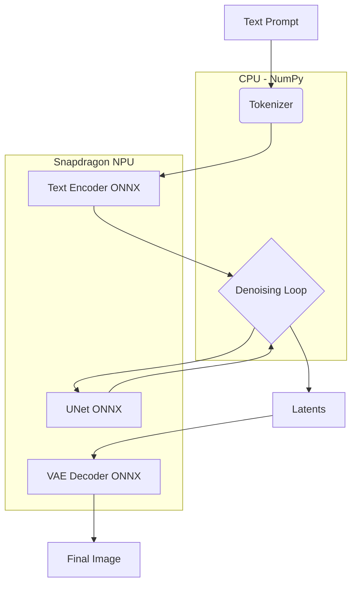

# Stable Diffusion v2.1 on Qualcomm Snapdragon NPU

This repository provides a high-performance, optimized implementation of Stable Diffusion v2.1 designed specifically for Windows ARM64 devices equipped with the Qualcomm Snapdragon X Elite processor.

## Sample Output

The following image was generated locally on a Snapdragon X Elite using this pipeline:

**Prompt**: "A breathtaking mountain landscape with a crystalline lake at sunset, high detail, 4k"  
**Resolution**: 512x512  
**Steps**: 20  
**Device**: Qualcomm Hexagon NPU (QNN HTP)


## Architecture Overview

The pipeline is implemented using a modular, PyTorch-free architecture to bypass dependency conflicts on Windows ARM64 and maximize hardware utilization via the ONNX Runtime QNN Execution Provider.



## Key Features

- **NPU Acceleration**: Full execution of Text Encoder, UNet, and VAE on the Qualcomm Hexagon NPU using the QNN Execution Provider.
- **PyTorch-Free Logic**: Orchestration, scheduling, and quantization are handled via NumPy, ensuring a lightweight and stable environment on Windows ARM64.
- **Euler Discrete Scheduler**: A custom implementation of the Euler Discrete scheduler optimized for NPU inference.
- **Advanced Quantization**: Manual management of w8a16 quantization parameters for high-fidelity on-device generation.

## Prerequisites

- **Hardware**: Snapdragon X Elite (or compatible Qualcomm Windows ARM64 device).
- **Software**: 
    - Windows 11.
    - Python 3.12 (ARM64).
    - Qualcomm QNN SDK (included in the ONNX Runtime QNN package).

## Installation

1. Create a virtual environment with Python 3.12:
   ```powershell
   python.exe -m venv venv312
   .\venv312\Scripts\activate
   ```

2. Install the required dependencies:
   ```powershell
   pip install onnxruntime-qnn numpy pillow tokenizers
   ```

## Usage

Run the inference script from the root of the repository:

```powershell
python run_inference.py --prompt "A majestic lion in the savanna, cinematic lighting, 4k"
```

### Arguments

- `--prompt`: The text description of the image you want to generate.
- `--neg_prompt`: Descriptions of what to exclude from the image.
- `--steps`: Number of denoising iterations (default: 20).
- `--guidance`: Classifier-free guidance scale (default: 7.5).
- `--output`: File path to save the resulting image (default: output.png).

## Repository Structure

- `run_inference.py`: CLI entry point for image generation.
- `src/`: Modular core components.
    - `pipeline.py`: Stable Diffusion orchestration logic.
    - `scheduler.py`: Euler Discrete Scheduler implementation.
    - `utils.py`: Quantization and image processing utilities.
- `models/`: Storage for precompiled Qualcomm-optimized ONNX models.


https://github.com/user-attachments/assets/8a2fdcd8-ef2d-4670-bad2-0deb4a84b55f


## Credits

Models optimized via Qualcomm AI Hub. Tokenizer provided by OpenAI CLIP.
