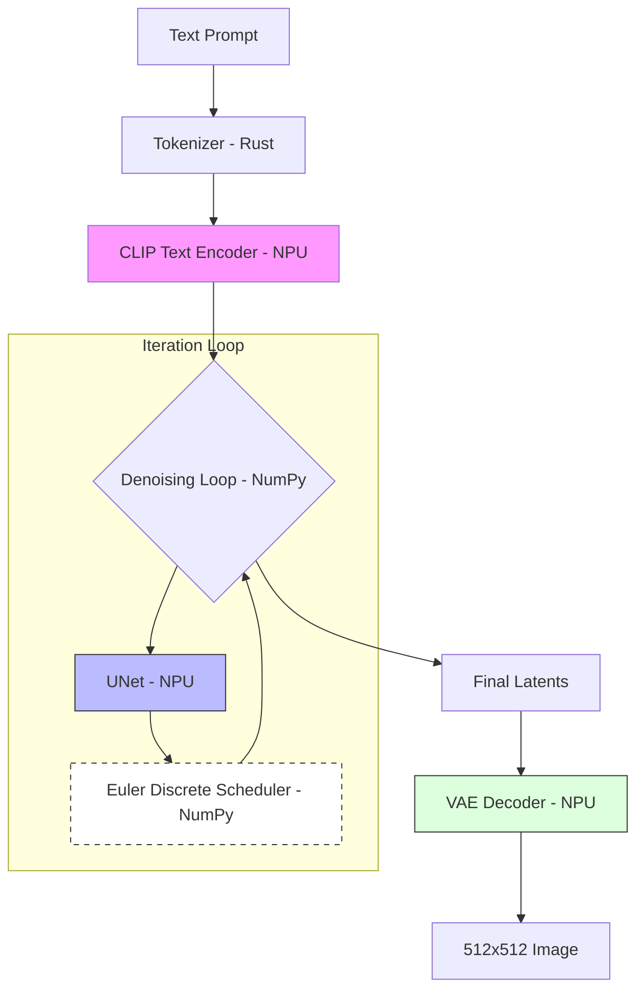

# On-Device Generative AI: Stable Diffusion v2.1 on the Snapdragon X Elite NPU

The promise of Generative AI has long been tied to massive cloud GPU clusters. However, the next frontier of AI is **local**, **private**, and **instant**. In this post, we explore the implementation of Stable Diffusion v2.1 on the Windows ARM64 Snapdragon X Elite NPU, leveraging the Qualcomm AI stack and a custom PyTorch-free orchestration layer.

---

## The Architecture of Stable Diffusion

Stable Diffusion is not a single model, but a pipeline of three distinct neural networks working in harmony within a "Latent Space."

### 1. Variational Autoencoder (VAE)
The VAE is the bridge between pixels and mathematics. Instead of processing a 512x512 RGB image directly (which is computationally expensive), the VAE "compresses" the image into a 64x64 "latent" representation. This 8x reduction in each dimension makes iterative denoising feasible on consumer hardware.

### 2. CLIP Text Encoder
When you type a prompt, the Text Encoder (specifically the CLIP ViT-L/14 model) converts your words into a high-dimensional vector. This vector acts as a "semantic map" that guides the generation process, ensuring the final image matches your intent.

### 3. UNet and the Denoising Loop
The heart of the system is the UNet. Starting with pure random noise in the latent space, the UNet predictively "subtracts" noise over several steps (e.g., 20 steps). Guided by the text embeddings, the noise gradually transforms into a coherent structural representation of your prompt.

---

## Technical Architecture Diagram

The following diagram illustrates the data flow through our NPU-optimized pipeline:

---

## Deep Dive: The Qualcomm AI Stack

Pushing these models to the NPU requires a sophisticated software-to-hardware bridge.

### 1. Hexagon HTP NPU
The Snapdragon X Elite features the Hexagon NPU with a dedicated **Hexagon Tensor Processor (HTP)**. Unlike a general-purpose CPU or GPU, the HTP is architected specifically for the tensor mathematics found in Transformers and CNNs. It excels at complex activations and high-throughput matrix multiplication with extreme power efficiency.

### 2. QNN SDK & ONNX Runtime
To run Stable Diffusion on the HTP, we utilize the **Qualcomm AI Stack** via the **ONNX Runtime QNN Execution Provider**. 
- **QNN SDK**: Provides the low-level libraries (`QnnHtp.dll`) that translate neural network graphs into Hexagon-executable instructions.
- **ONNX Runtime**: Acts as the high-level engine, orchestrating the execution of ONNX models across different backends.

### 3. W8A16 Quantization
Performance on the NPU is heavily tied to quantization. Our implementation uses models optimized with **w8a16** precision:
- **Weights (8-bit)**: Compressing model weights to 8-bit integers drastically reduces memory bandwidth requirements.
- **Activations (16-bit)**: Keeping activations at 16-bit ensures that we maintain the high visual fidelity required for realistic image generation.

---

## The "PyTorch-Free" Implementation Strategy

One of the unique challenges of Windows ARM64 is the current lack of native, unified wheels for massive libraries like PyTorch. To create a stable, portable, and fast solution, we opted for a **PyTorch-free orchestration layer**:

1. **NumPy for Mathematics**: We implemented the **Euler Discrete Scheduler** and all tensor manipulations (quantization/dequantization) directly in NumPy.
2. **Rust-based Tokenizers**: By using the `tokenizers` library (built in Rust), we avoid the need for the heavy `transformers` package.
3. **Direct ONNX Integration**: By speaking directly to the ONNX Runtime QNN provider, we remove layers of abstraction, leading to a faster "cold start" and lower memory overhead.

## Conclusion

Local Generative AI is no longer a futuristic concept—it's a reality on the Snapdragon X Elite. By combining the Latent Diffusion architecture with the Qualcomm AI Stack, we’ve created a pipeline that is not only fast but entirely private and offline.

Whether you're a developer building the next generation of creative tools or an enthusiast exploring the limits of your hardware, the NPU is the key to unlocking the true potential of the PC.
